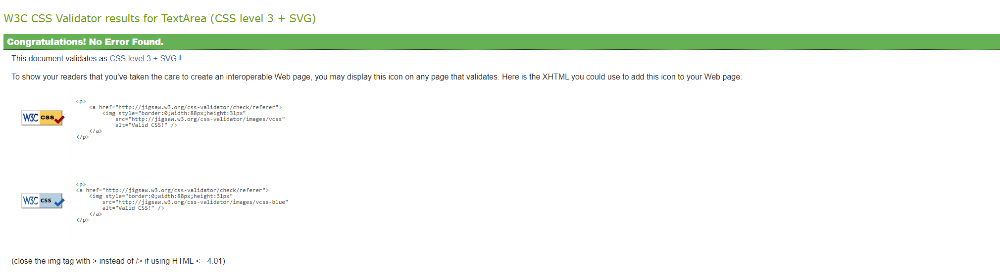
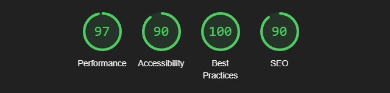

# Overview
This project aims to create a user-friendly platform that allows users to connect, communicate, and showcase their interests through customizable profiles and interactive features. Below are the key user stories that outline the functionalities of the application.

### Target Audience
This application is designed for individuals who are looking to connect with others based on shared interests and collaborate within a community. The target audience includes:

- **Social Media Enthusiasts:** Users who enjoy networking and engaging with others through online platforms.
- **Professionals and Creatives:** Individuals seeking to showcase their skills, portfolios, and interests to a broader audience.
- **Students and Learners:** Users interested in connecting with peers for study groups, projects, and collaborative learning.

## User Stories
1. As a user, I can create an account so that I can customize my profile
```
##ACCEPTANCE CRITERIA
- As a new user, I can register with the sight
- As a user, I can change/ update my password
```

2. As a returning user, I can log in securely so that I can access my profile and connect with other users.
```
##ACCEPTANCE CRITERIA
- Returning user is able to log in using their login credentials
- User is able to reset the password for their own account
- The user is able to be notified when they are logged into the site
- When the user is logged in they have additional features
```

3. As a user, I want to send messages so that I can collaborate with other users on-site
```
##ACCEPTANCE CRITERIA
- Users have a dashboard to be able to see messages from each other
- Messages are successfully sent and received by the different users
```

4. As a user, I can create and edit my profile so that ** I can showcase my interests and personality.**
```
##ACCEPTANCE CRITERIA
- Users can update their profile picture
- User can update their bio
```

5. As a user, I can ** view other users' profiles** so that I can learn more about them and connect based on shared interests.
```
##ACCEPTANCE CRITERIA
- Users can search for other existing users
- Users can view other existing users' profile
```

6. As a user, I can edit my post so that I can correct any mistakes or update after posting
```
##ACCEPTANCE CRITERIA
- User can update/edit their post
- Updated posts should be saved and displayed
```

7. As a user, I can delete my post so that I can correct any mistakes posting
```
##ACCEPTANCE CRITERIA
- User can delete their post
- Users get confirmation before deleting
- Deleted posts should not be displayed
```

# Design Phase
## Wireframe
<details>
  <summary> Log In / Registration Page</summary>
  
  
  
</details>

<details>
  <summary> Home </summary>
  
  
</details>

<details>
  <summary> Account </summary>

  
</details>

## ER Diagram 
<details>
  <summary> ER Diagram </summary>

  
</details>


## Colour Scheme
<details>
  <summary> Colour Scheme Options Variants With Wire-Frame </summary>
  
  
  
  
</details>
Chosen Colour Scheme Template:
 
 
 
Using #1DA1F2  in the navigation bar creates a clear focal point, guiding users toward key navigational elements. Its vibrant yet calming nature enhances readability and contrast, ensuring the interface remains user-friendly. Blue also evokes trust and reliability, making the app feel approachable and secure.

#DDDDDD  as the body background creates a soft and clean backdrop, ensuring that content, buttons, and interactive elements stand out clearly. It also reduces strain on the eyes compared to pure white while maintaining a modern, minimalist aesthetic.

#FFFFFF  for the content background ensures a clean, readable space that highlights user interactions. Paired with #DDDDDD  body background, it creates clear visual separation and balance.

#17BF63  for buttons adds a vibrant, energetic touch that draws attention to interactive elements. This colour choice reinforces positive actions like submitting or following while ensuring buttons stand out against the neutral backgrounds.

## Fonts 

# Features

### Search Options

The Search Options feature enables users to search for other existing users on the platform efficiently. By entering a username, users are presented with a list of matching profiles in the search bar. The search results are displayed in real time, allowing users to quickly find and connect with others. This feature enhances social interactions by making discovering new profiles easy and building community connections.
<details>
  <summary>Search Image</summary>
  
  
</details>

### User Post

The User Post feature allows users to not only share their updates but also view their entire post history in one place. Users can easily see a list of all their previous posts, along with the exact date and time when each post was made. This feature provides a comprehensive view of their activity, giving them full control over their content and allowing them to reflect on their posting timeline.
<details>
  <summary>User Post Image</summary>

  
</details>

### User Authentication

The User Authentication feature ensures that users can securely log into the platform to access specific functionalities. Once authenticated, users can interact with key features such as creating and viewing their posts, as well as exploring other user profiles. This system protects personal data and ensures that only logged-in users can engage with the platform's more interactive and personalized features.

<details>
  <summary> User Post when logged out</summary>

  

  <summary> User Post when logged in</summary>

  
</details>

### User Profile

The User Profile feature gives users a complete view of their social interactions by allowing them to see both the users they are following and those who are following them. This keeps users connected and up to date with new posts from the people they follow, ensuring they don't miss any updates. It also provides an easy way to manage and explore relationships within the platform.

<details>
  <summary>User Profile Image</summary>

</details>

# Testing

## HTML Validation


## CSS Validation



## Google Lighthouse



## CI Python Linter


## User Story testing
| Test Number | User Story | Acceptance Criteria | Pass| Fail | 
| --- | --- | --- | --- | --- |
| No.1 | As a user, I can create an account so that I can customize my profile | As a new user I can register with the sight | ✔️ |  |
| | |As a user, I can change/ update my password | - | ❌ |
| No.2 | As a returning user, I can log in securely so that I can access my profile and connect with other users.| Returning user is able to log in using their login credentials. | ✔️ | - |
| | | User is able to reset the password for their own account | - | ❌ |
| | | The user is able to be notified when they are logged into the site | ✔️ | - |
| | | When the user is logged in they have to additional features | ✔️ | - |
| No.3 |As a user, I want to send messages so that I can collaborate with other users on-site. | Users have a dashboard to be able to see messages from each other. | ✔️ | - |
| | | Messages are successfully sent and received by the different users. | ✔️ |  |
| No.4 |As a user, I can create and edit my profile so that ** I can showcase my interests and personality.** | User can update profile picture. | ✔️ | - |
| | | User can update their bio. | ✔️ | - |
| No.5 |As a role, I can ** view other users' profiles** so that I can learn more about them and connect based on shared interests. | User can search for other existing users. | ✔️ | - |
| | | Users can view other existing users' profiles. | ✔️ | - |
| No.6 |As a user, I can edit my post so that I can correct any mistakes or update after posting. | User can update/edit their post. | - | ❌ |
| | | Updated posts should be saved and displayed | ✔️ |  |
| No.7 |As a user, I can delete my post so that I can correct any mistakes posting. | User can delete their post. | - | ❌ |
| | | User gets confirmation before deleting. | - | ❌ |
| | | Deleted posts should not be displayed. | - | ❌ |

## Deployment

### Prepare the Environment and settings.py

Create the env.py file:

In your project root directory (e.g., /workspace/your_project), create an env.py file.

Add your environment variables, such as the SECRET_KEY, and DATABASE_URL.

```
import os

os.environ["SECRET_KEY"] = "your-secret-key"
os.environ["DATABASE_URL"] = "your-database-url"
```

Update settings.py:

Import your env.py file in settings.py:

```
import os
if os.path.isfile("env.py"):
    import env
```
Update the following parts in settings.py:

Set the SECRET_KEY and DATABASE_URL from environment variables:

```
SECRET_KEY = os.getenv("SECRET_KEY")
DATABASES = {
    'default': dj_database_url.parse(os.getenv("DATABASE_URL"))
}
```

### Steps to Deploy on Heroku:

Install dependencies:

```
pip3 install -r requirements.txt
```
Create a Procfile with the following content:
```
web: gunicorn chirp.wsgi
```
Ensure the ALLOWED_HOSTS in your settings.py includes the Heroku domain:

```
ALLOWED_HOSTS = ['chirp-ed4fcf68cb92.herokuapp.com']
```
Open your (Sign up or Log in) Heroku app:

- If you don’t have a Heroku account, visit [Heroku's](https://www.heroku.com/) website and sign up for an account. If you already have an account, log in.

Create a New App:

- Once logged in, go to the Heroku Dashboard.
- Click on the “New” button in the top right corner and select “Create new app.”

- Choose a unique name for your app and select your preferred region, then click “Create app.”

Connect to Your GitHub Repository:

- On your app’s dashboard, navigate to the “Deploy” tab.
- In the “Deployment method” section, select “GitHub.”

- Authorize Heroku to access your GitHub account if prompted.
- Search for your repository and click “Connect.”

Configure Environment Variables:

- Navigate to the “Settings” tab.
- Click on “Reveal Config Vars.”
- Add your environment variables, such as **SECRET_KEY** and **DATABASE_URL** by entering the key in the "KEY" field and the value in the "VALUE" field.

Deploy Your App:

- In the “Deploy” tab, scroll down to the “Manual Deploy” section.
- Choose the branch you want to deploy (usually main) and click “Deploy Branch.”
- Heroku will start the deployment process. You can view the logs for any errors or confirmation messages during this process.

Run Database Migrations:

- Once the deployment is complete, navigate to the “More” button in the top right corner of the dashboard and select “Run console.”

- In the command line interface, run:
```
python manage.py migrate
```
Collect Static Files:
- Still in the console, run the following command to collect static files:
```
python manage.py collectstatic
```
Open Your App:

After deployment and migrations are complete, go back to the “Overview” tab.

Click on the “Open app” button to view your live application.
